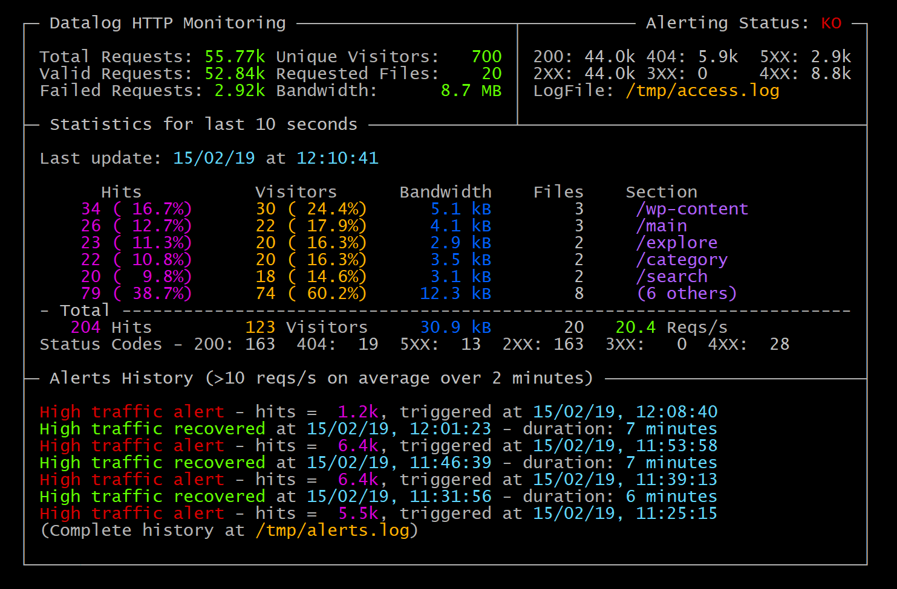

# DataLog HTTP Monitoring

This tool parses http log files and display statistics about it.

## Install

> Python 3.7 is required to run the project (3.6 might run okay though)

    $ python setup.py install
    $ datalog -h
    
    
## Run

For a simple demo (will generate random logs):

    $ datalog --demo
    
With real log files:

    $ datalog /path/to/http.log
    
 
## Docker

A container is available and will run the command line directly

    $ docker build --rm --tag datalog .
    $ docker run --rm -ti datalog --help

## Command line

This tool can also be called from command line and offers various options:

    $ datalog --help
    usage: run.py [-h] [--period PERIOD] [--alert THRESHOLD]
              [--alert-period ALERT_PERIOD] [--alert-file ALERT_FILE]
              [--refresh REFRESH] [--no-curses] [--demo] [--debug]
              [--debug-file FILE] [--debug-color]
              [LOGFILE [LOGFILE ...]]

    Collect logs and display realtime formatted statistics
    
    positional arguments:
      LOGFILE               Files to collect logs from (default: ['/tmp/access.log'])
    
    optional arguments:
      -h, --help            show this help message and exit
      --period PERIOD       monitoring period to display statistics (default: 10)
      --alert THRESHOLD     minimum number of requests to trigger alert mode (default: 10)
      --alert-period ALERT_PERIOD
                            period to look for threshold alert (default: 120)
      --alert-file ALERT_FILE
                            where to store alerts details (default: /tmp/access.log)
      --refresh REFRESH     statistics display refresh delay (default: 0.5)
      --no-curses           fallback to simple print for display
      --demo                auto generate logs for debugging purpose
      --debug               show application debug information
      --debug-file FILE     write application debug information to this file (default: stderr)
      --debug-color         colorize application debug information (implies --debug)

## Testing

You can simply run the tests using:

    pip install pytest 
    pytest tests

## Coverage

To run tests with coverage:

    pip install pytest-cov
    pytest --cov

## Roadmap

  - [x] Consume an actively written-to w3c-formatted HTTP access log (https://www.w3.org/Daemon/User/Config/Logging.html). It should default to reading /tmp/access.log and be overrideable
  - [x] Display stats every 10s about the traffic during those 10s: the sections of the web site with the most hits, as well as interesting summary statistics on the traffic as a whole. A section is defined as being what's before the second '/' in the resource section of the log line. For example, the section for "/pages/create" is "/pages"
  - [x] Make sure a user can keep the app running and monitor the log file continuously
  - [x] Whenever total traffic for the past 2 minutes exceeds a certain number on average, add a message saying that “High traffic generated an alert - hits = {value}, triggered at {time}”.
  - [x] The default threshold should be 10 requests per second, and should be overridable.
  - [x] Whenever the total traffic drops again below that value on average for the past 2 minutes, add another message detailing when the alert recovered.
  - [x] Make sure all messages showing when alerting thresholds are crossed remain visible on the page for historical reasons.
  - [x] Write a test for the alerting logic.
  - [x] Explain how you’d improve on this application design.
  - [x] If you have access to a linux docker environment, we'd love to be able to docker build and run your project! If you don't though, don't sweat it.

  
## Improvements

  - [x] Use curses
  - [x] Pipfile
  - [x] Log generator
  - [x] Create setup.py for command install
  - [x] Coverage
  - [ ] Better unittests
  - [ ] Better documentation
  - [ ] Better logging (not flooding like hell)
  - [ ] Avoid UI overflow
  - [ ] Add log files names to UI
  - [ ] Detect and handle log rotation
  - [ ] ~~Maybe asyncio instead of processes~~ (Nope, aiofiles is struggling)
